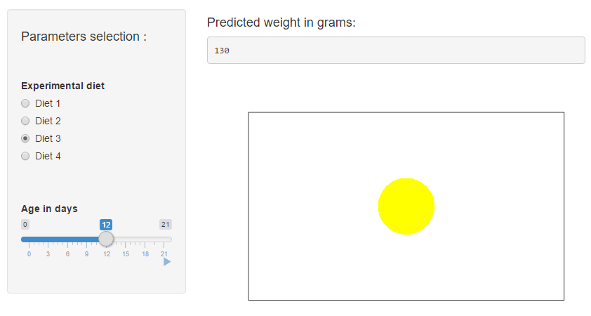

## Goal and Introduction
This shiny app allows predicts the weight of a chick with respect to its age in days and its experimental diet. It is based on the ChickWeight R dataset.   
The app is available at : https://djuls-nyc.shinyapps.io/shiny/   



--- .class #id 

## Under the hood

### Dataset:
* Chick : an ID,
* Time : number of days since birth
* Diet: one of 4 different diets
* weight: body weight in gm

### Prediction model chosen:
* exponential: $\exp(a \times Time+b)$ 
* one model per diet
* using linear regression applied to $\log(weight)$

--- .class #id 

## A look at one of the prediction model
```{r, fig.height=4}
myData <- ChickWeight
myData$logWeight <- log(myData$weight)
verifData <- data.frame(Time=as.numeric(0:21))
mod1 <- lm(logWeight~Time, data = subset(myData, Diet=="1"))
w1 <- exp(predict(mod1, newdata = verifData))
plot(weight~Time, data = subset(myData, Diet=="1"))
points(x=verifData$Time, y=w1, pch=21, col="red", type="l" )
```

--- .class #id 

## Conclusion
* A shiny app deployed on shinyapps.io
* Using some kind of inputs,
* and displaying some kind of reactive output calculated by the server.
* We won't change the world today.
* Chicks rock.   


